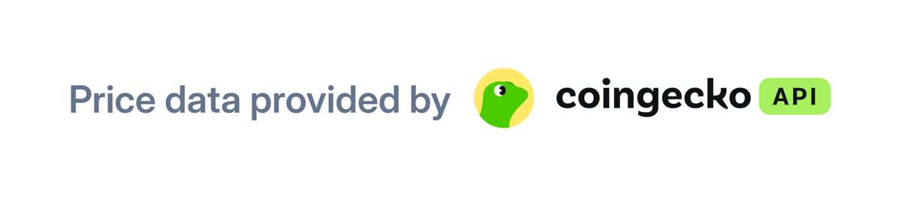
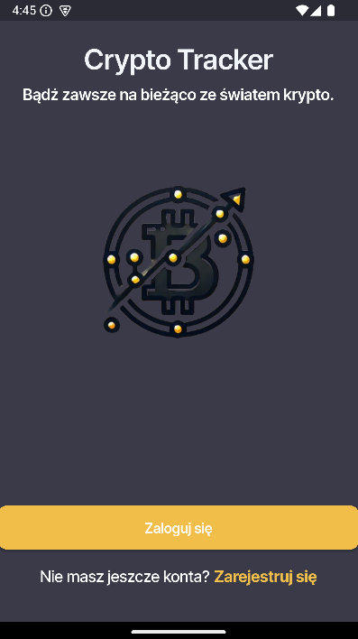
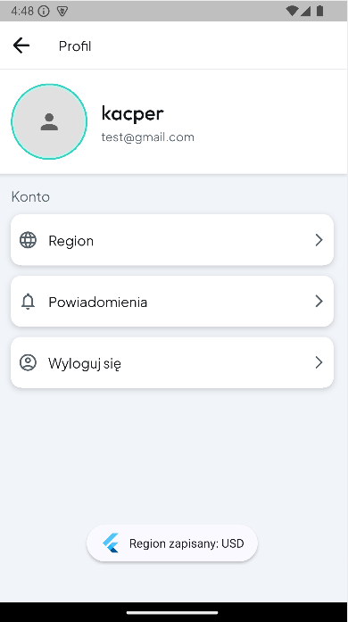
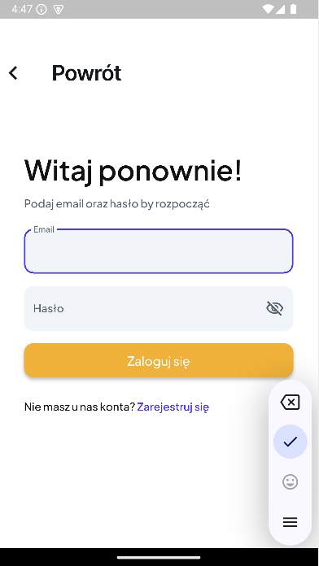
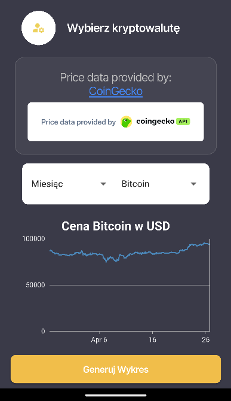

# Crypto Tracker 🚀

**Crypto Tracker** is a simple experimental mobile app for gathering and displaying real-time data about various cryptocurrencies using an external API.

Built with **Flutter (Dart)**, the app is intended for both **iOS** and **Android**.  
Currently, it runs only on Android devices or emulators — unfortunately, I don't own a MacBook yet to fully support iOS development.

---

## 🛠️ Technologies Used

- **[CoinGecko API](https://www.coingecko.com/)** for cryptocurrency data.  
  > All credit for the provided data goes to CoinGecko.

  

- **SQLite**:  
  Flutter provides various extensions, including support for SQLite.  
  I use a local SQLite database to simulate a basic user authorization system when switching between app screens.

---

## 🔑 Setting Up the API Key

To make the app work properly, you need to generate your own personal **API demo key**.

1. Create a `.env` file in the **root project directory** (the same level as `pubspec.yaml`).
2. Add the following line:

  
   API_KEY='your_generated_key_here'

3. For more details on how to generate and set up your API key, visit the  
   👉 [CoinGecko API Documentation](https://docs.coingecko.com/v3.0.1/reference/introduction).

---

## ⚠️ Current Known Issues

- **Price Alert System**:  
  While API calls and requests work fine, scheduled tasks using the Flutter `workmanager` extension behave inconsistently.  
  Sometimes alerts are sent correctly, sometimes they aren't.  
  This issue might be related to the current version of `workmanager`.  
  **A fix is planned soon!** 🛠️

---

## 📲 Getting Started

If you're new to Flutter, here are some useful resources to help you get started:

- [Lab: Write your first Flutter app](https://docs.flutter.dev/get-started/codelab)
- [Cookbook: Useful Flutter samples](https://docs.flutter.dev/cookbook)
- [Flutter Official Documentation](https://docs.flutter.dev/)

---

## 📸 Screenshots

Below are some screenshots showcasing the app’s interface:

| Welcome Screen | Account View |
|:--------------:|:------------:|
|  |  |

---

| Login Screen | Home Page View |
|:------------:|:--------------:|
|  |  |

---

## 📝 Extra Notes

Please note that some comments and variable names in the codebase are written in **Polish**,  
which might make debugging slightly more challenging for non-Polish-speaking developers.

---

> Thanks for checking out **Crypto Tracker**! 🚀 Feel free to fork, modify, or contribute!
